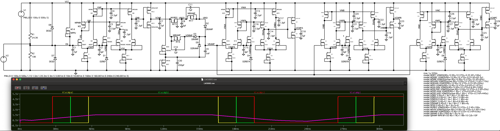

## LM3880 Model



The enable line EN drives the comparator input that compares the enable voltage to the reference voltage 1.2V.
When this threshhold is exceeded, it drives the constant current source to charge the ramp capacitor.
The ramp voltage is compared to the reference voltages for each stage.
The result is a sequence of enable-low with delay of about 18ms.
Other variants covered by the datasheet have different delays. By adjusting the ramp capacitor,
the ramp current, and the threshhold voltages, other time delays should be possible.

When the EN line goes low, the capacitor is discharged at a constant current rate, and the process is
reversed, with the outputs driven high in reverse order, after delays of about 18ms.

The hard part about this circuit is getting a linear ramp that is independent of the power supply.
This is done by charging through a current diode to a maximum voltage that is less than the minimum supply voltage.
The built-in regulator creates this internal supply VRGO.

The digital outputs are driven by inverters to make them rail-to-rail with sufficient current drive.
The digital outputs have substantial drive current capability.

The comparator circuit is based on Johns "Analog Integrated Circuit Design". 
The hysteresis in the Johns design is omitted.

To debug this circuit, first check the input supply voltage on pin VCC and the enable line EN.
Here is the test condition for turning on the enables:
  -  VCC should be greater than the 2.7V minimum supply voltage
  -  EN should be greater than the 1.25V threshhold voltage
In this condition:
  -  The transistor M12 should be on
  -  The voltage VCMP should be close to the voltage VCC
  -  The voltage VRGO should be about 2.15V
  -  The voltage VRAMP should ramp up at 20V/sec or 0.4V in 20ms
  -  The while VRAMP is rising, the constant current from M17 should be about 89nA

Command to convert the LTspice cir file to NGSpice:
```
python ltspice_to_subckt.py --input=ltspice/LM3880.cir --output=ltspice/LM3880.tmpl -s --verbose \
    --subckt='LM3880' \
    --pins='VCC:VCC, GND:0, EN:EN, FLAG3:VCMPA, FLAG2:VCMPB, FLAG1:VCMPC' \
    --exclude='V1, V2, R2'
```

Command to convert the LTspice cir file to a stanza model template:
```
python ltspice_to_subckt.py --input=ltspice/LM3880.cir --output=ngspice/LM3880.tmpl -t --verbose \
    --subckt='LM3880' \
    --pins='VCC:VCC, GND:0, EN:EN, FLAG3:VCMPA, FLAG2:VCMPB, FLAG1:VCMPC' \
    --exclude='V1, V2, R2'
```


