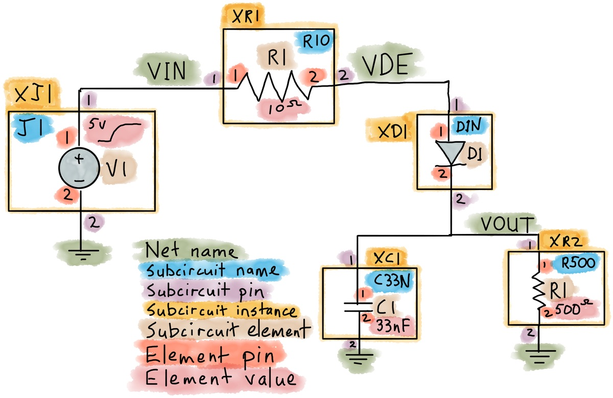

# Stress analysis from an NGSpice dataset

The NGSpice simulator saves its data in a raw file format.

The convention for the simulation is that all parts have a subcircuit.
Most stress analysis equations can be contructed from the netlist
of the simulation and the contents of the raw file.
By default, NGSpice does not store enough information to calculate
the component stress. The commands to save the required voltages
and currents have changed in recent versions of NGSpice. These
instructions are for NGSpice version 33.

To store the required voltages and currents, add these lines:
```
.options savecurrents filetype=ascii
.save all
```

## Example 1: Resistor and Voltage source

This example has one resistor and one voltage source.
The resistor value is 1k and the voltage is 5V.
The power should be P = V^2/R = 25 mW
The voltage stress is 5 V.
```
.title Resistor test circuit
*
* Voltage source on connector J1
.subckt J1 1 2
V1 1 2 EXP(0 5 10u 10u 20 20)
.ends
* Resistor, 1K component R1
.subckt R1K 1 2
R1 1 2 1k
.ends
XJ1 VIN 0 J1
XR1 VIN 0 R1K
*
.options savecurrents filetype=ascii
.tran 1u 100u 0 10u
*
.end
```

Run the netlist with:
```
ngspice -a -b -o res1.txt -r res1.raw res1.cir
```

This creates a file res1.raw.
In this file, the available variables are:

```
Variables:
	0	time	time
	1	v(vin)	voltage
	2	i(v.xj1.v1)	current
	3	i(@r.xr1.r1[i])	current
```

NGSpice reports the currents for two-pin devices as being positive when the current
is flowing into the first pin in the netlist.

The current i(@r.xr1.r1[i]) should be positive, as the positive
voltage causes a current to flow into the first pin of R1 in subcircuit R1K,
which is instantiated as the subcircuit call XR1.

The current i(v.xj1.v1) should be negative, because it flows out of the first
pin of V1 in subcircuit XJ1, which is instantiated as the subcircuit call XJ1.

The current flowing into the second pin of a two-pin device is the negative
of the current flowing into the first pin.

The final timepoint in the ASCII raw file is:
20		9.999999999999999e-05
	4.999382950979567e+00
	-4.999382950979567e-03
	4.999382950979567e-03

The first number is the value of time at the last time point.
Notice that because of rounding error, it is not at the requested 100e-6 seconds.

The next number is the input voltage. It is not quite 5 because the voltage
source is an exponential ramp that is still settling within the last millivolt.
Next is the 5 V voltage source, which has a negative current as expected.
The resistor has a positive current, also as expected.

The simulation conserves energy, so the sum of the power dissipations of all the
components is zero. This is true at every time point in the simulation, but for
purposes here, look at the last time point. To see the last time point in ngnutmeg,
an index can be defined with:
```
npt = length (time)-1
```

The power dissipation in a component is the sum of voltage times current at all
of its pins. Since the components are connected to ground, the second term is
zero, but it is shown here:

```
pxj1_ss = ( vin[npt] * i(v.xj1.v1)[npt] - 0 * i(v.xj1.v1)[npt] )
pxr1_ss = ( vin[npt] * i(@r.xr1.r1[i])[npt] - 0 * i(@r.xr1.r1[i])[npt] )
ptotal_ss = pxj1_ss + pxr1_ss
print pxj1_ss pxr1_ss ptotal_ss
```

Result:
```
pxj1_ss = -2.49938e-02
pxr1_ss = 2.499383e-02
ptotal_ss = 0.000000e+00
```

In general, the loads have positive power dissipation and the voltage sources
have negative power dissipation.

As far as I can tell, ngnutmeg does not use memoization or other speedups in these
calculations. Evaluation is done with macro substitution, and expressions like this
are not efficient. When the circuit size is large, the compute time for this type
of stress calculation can exceed the simulation time. It is worthwhile to look at
other environments for post processing. The ngspice output data is available as either
a simple ASCII format or a binary format with an ASCII header.

## Example 2: Detector Circuit



### Schematic

Simulation Netlist:
```
.title Resistor test circuit
*
* Voltage source on connector J1
.subckt J1 1 2
V1 1 2 EXP(0 5 10u 3u 20 20)
.ends
*
* Resistor, 10 Ohm
.subckt R10 1 2
R1 1 2 10
.ends
*
* Resistor, 500
.subckt R500 1 2
R1 1 2 500
.ends
*
* Capacitor, 10nF
.subckt C33N 1 2
C1 1 2 33n
.ends
*
* Diode, simple
.subckt D1N 1 2
D1 1 2 D1N9
.model D1N9 D RS=1 N=1.5
.ends
*
* Main circuit
XJ1 VIN 0 J1
XR1 VIN VDE R10
XD1 VDE VOUT D1N
XC1 VOUT 0 C33N
XR2 VOUT 0 R500
*
* Control section
.options savecurrents filetype=ascii
.tran 1u 100u 0 1u
*
.end
```

Example NGNutmeg Commands:
```
display
plot i(@d.xd1.d1[id]) i(@c.xc1.c1[i])
plot v(vin) v(vout) v(vde)
```

Output:
```
    i(@c.xc1.c1[i])     : current, real, 108 long
    i(@d.xd1.d1[id])    : current, real, 108 long
    i(@r.xr1.r1[i])     : current, real, 108 long
    i(@r.xr2.r1[i])     : current, real, 108 long
    i(v.xj1.v1)         : current, real, 108 long
    time                : time, real, 108 long [default scale]
    v(vde)              : voltage, real, 108 long
    v(vin)              : voltage, real, 108 long
    v(vout)             : voltage, real, 108 long
```
Graphical output:<br />
<a img src="detector_1/det_voltage_1.png"><br />
<a img src="detector_1/det_current_1.png"><br />

The parts have voltage ratings, current ratings, and power ratings.
Helper functions in NGSpice make the formulas more readable.

For this circuit, the ratings are:
 - Peak diode current
 - Steady state diode current
 - Diode power
 - Resistor power
 - Resistor maximum voltage
 - Capacitor maximum voltage

The formulas for extracting these stress levels can be stored as comments inside the subcircuits.
The stress levels are expressed as functions of:
 - The pin voltages and currents at the ports
 - The subcircuit element voltages and currents.
In addition to calculation of the stress levels, the stress absolute maximum ratings can be stored
as comments in the subcircuits. A program can translate these stress equations into a script
that runs in NGNutmeg or other scripted data reduction process.

Example:
Stress function definition:
```
define maxabs(x) maximum(abs(x))
npt = length (time)-1
```

## Stress Analysis

Here is a full stress analysis script for the example circuit.
This is the contents of the stress_analysis.cmd file.

```

* Diode D1 stress analysis
set d1_max_i=maxabs(i(@d.xd1.d1[id]))
echo "Peak diode current in D1:"
print $d1_max_i

set d1_ss_i=(i(@d.xd1.d1[id]))[npt]
echo "Steady state diode current in D1"
print $d1_ss_i

set d1_pwr=i(@d.xd1.d1[id])*(v(vde)-v(vout))
echo "Peak power in diode D1:"
print maximum($d1_pwr)

set d1_ss_pwr=i(@d.xd1.d1[id])[npt]*(v(vde)[npt]-v(vout)[npt])
echo "Steady state power in diode D1:"
print $d1_ss_pwr
* Capacitor C1 stress analysis
*
set c1_max_v=maxabs(v(vout))
echo "Maximum voltage on capacitor C1:"
print $c1_max_v
*
set c1_pwr=i(@c.xc1.c1[i])*v(vout)
echo "Check for steady-state power in capacitor C1:"
print ($c1_pwr)[npt]

* Resistor R1 stress analysis
set r1_max_v=maxabs(v(vout))
echo "Maximum voltage on resistor R1:"
print $r1_max_v

set r1_pwr=i(@r.xr1.r1[i])*(v(vin)-v(vde))
echo "Maximum power on resistor R1:"
print maximum($r1_pwr)

echo "Steady state power on resistor R1:"
print ($r1_pwr)[npt]

* Resistor R2 stress analysis
set r2_max_v=maxabs(v(vout))
echo "Maximum voltage on resistor R2:"
print $r2_max_v

set r2_pwr=i(@r.xr2.r1[i])*v(vout)
echo "Maximum power on resistor R2:"
print maximum($r2_pwr)

echo "Steady state power on resistor R2:"
print ($r2_pwr)[npt]

* Power supply stress analysis
set j1_pwr=i(v.xj1.v1)*v(vin)
echo "Steady state power delivered by connector J1:"
print (-$j1_pwr)[npt]

echo "Maximum power delivered by connector J1:"
print maximum(-$j1_pwr)
```

This can be run from the NGSpice prompt and redirected to a file output.

```
source stress_analysis.cmd > stress.out
```
The resulting output is a bit noisy:
```
Peak diode current in D1:
maxabs(i(@d.xd1.d1[id])) = 3.352570e-02
Steady state diode current in D1
(i(@d.xd1.d1[id]))[npt] = 7.706645e-03
Peak power in diode D1:
maximum(i(@d.xd1.d1[id])*(v(vde)-v(vout))) = 3.861328e-02
Steady state power in diode D1:
i(@d.xd1.d1[id])[npt]*(v(vde)[npt]-v(vout)[npt]) = 8.243112e-03
Maximum voltage on capacitor C1:
maxabs(v(vout)) = 3.853323e+00
Check for steady-state power in capacitor C1:
(i(@c.xc1.c1[i])*v(vout))[npt] = 2.134982e-14
Maximum voltage on resistor R1:
maxabs(v(vout)) = 3.853323e+00
Maximum power on resistor R1:
maximum(i(@r.xr1.r1[i])*(v(vin)-v(vde))) = 1.076254e-02
Steady state power on resistor R1:
(i(@r.xr1.r1[i])*(v(vin)-v(vde)))[npt] = 5.939238e-04
Maximum voltage on resistor R2:
maxabs(v(vout)) = 3.853323e+00
Maximum power on resistor R2:
maximum(i(@r.xr2.r1[i])*v(vout)) = 2.969619e-02
Steady state power on resistor R2:
(i(@r.xr2.r1[i])*v(vout))[npt] = 2.969619e-02
Maximum energy imbalance:
maximum(abs(i(v.xj1.v1)*v(vin)+i(@d.xd1.d1[id])*(v(vde)-v(vout))+i(@c.xc1.c1[i])*v(vout)+i(@r.xr1.r1[i])*(v(vin)-v(vde))+i(@r.xr2.r1[i])*v(vout))) = 8.285653e-04
```

## Energy balance verification

There are now expressions for the power in each component.
Add the power from the input, and compute the total power.
```
set load_pwr=$d1_pwr+$c1_pwr+$r1_pwr+$r2_pwr
set imbalance=abs($j1_pwr+$load_pwr)
echo "Maximum energy imbalance:"
print maximum($imbalance)
```


